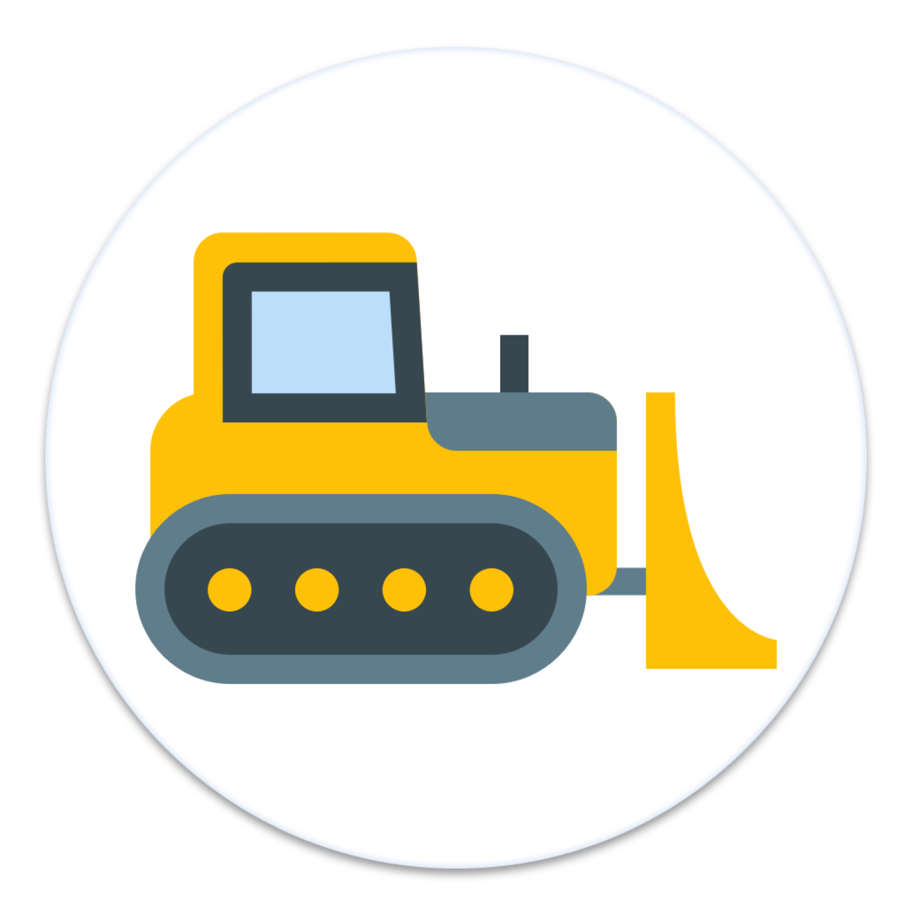
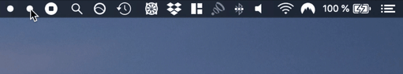

<p align="center">
	
</p>
<p align="center">Hide menu bar icons to give your Mac a cleaner look.</p>
<p align="center">
	<a href="https://github.com/pawiromitchel/Dozer/releases/latest"></a>
	
	
	<a href="https://opensource.org/licenses/MPL-2.0"></a>
</p>
<p align="center">
	
</p>

> **Community fork.** [Mortennn/Dozer](https://github.com/Mortennn/Dozer) has been unmaintained since 2021.
> This fork fixes the crash on screen lock, runs natively on Apple Silicon, remembers icon positions,
> and builds without Xcode. See the [changelog](CHANGELOG.md).

## ⚙️ Install

### Via Homebrew

This repository is its own Homebrew tap, so there is no separate tap to maintain:

```shell
brew tap pawiromitchel/dozer https://github.com/pawiromitchel/Dozer
brew install --cask pawiromitchel/dozer/dozer
```

The cask installs `Dozer.app` from the latest GitHub release. To update later: `brew upgrade --cask dozer`.

> Recent Homebrew versions refuse to load casks from third-party taps until you trust them. If `brew install` tells you the tap is untrusted, run `brew trust pawiromitchel/dozer` and retry.

### Manually

[Download `Dozer.zip`](https://github.com/pawiromitchel/Dozer/releases/latest), unzip it and move `Dozer.app` to Applications.

Release builds are ad-hoc signed, not notarized. The first time, right-click the app and choose **Open**, or run:

```shell
xattr -dr com.apple.quarantine /Applications/Dozer.app
```

Or build it yourself (only the Xcode Command Line Tools are needed):

```shell
git clone https://github.com/pawiromitchel/Dozer && cd Dozer && make install
```

Your settings and keyboard shortcut from Dozer 4.x carry over automatically.

## 🚜 How it works

Dozer adds **one bulldozer** to your menu bar. Everything to its left gets dozered.

* Hold ⌘ and drag the bulldozer to where you want it. Icons left of it get hidden; icons right of it always stay visible
* Click the bulldozer to hide them. A badge on it shows how many it dozered
* Click again to bring them back

Dozer remembers where you put the bulldozer.

## 👇 Interactions
* Click the bulldozer to hide/show the icons to its left
* Right-click (or control-click) the bulldozer for Settings, Show All Icons, updates and Quit
* Set a global keyboard shortcut in Settings. With a shortcut you can also hide the bulldozer itself
* Optional: enable the small "remove" dot in Settings for a second group, revealed with option-click
* Open Dozer again from Finder or Spotlight to reveal everything and open Settings

## 🤖 Automation

Dozer handles `dozer://` URLs, so you can drive it from Shortcuts, Raycast, Alfred or a script:

```shell
open dozer://toggle    # also: show, hide, show-all, settings
```

## 🪶 Footprint

Measured on macOS 26 (Apple Silicon): about 55–65 MB of memory, flat after 120 hide/show cycles (no leak), and about 0.1% CPU with auto-hide on, which polls once a second only while icons are shown.

## 🛠 Development

```shell
make run      # debug build, then launch build/Dozer.app
make test     # unit tests
make app      # universal release build in build/Dozer.app
make install  # release build, copied to /Applications
make demo-gif # regenerate Stuff/demo.gif from the real drawing code
```

The app is a plain Swift package (`Package.swift`), so you can also open the folder in Xcode.
`Scripts/statusitems.swift` lists menu bar items with their positions. Debug logs:

```shell
log stream --level debug --predicate 'subsystem == "com.mortennn.Dozer"'
```

### Releasing

Push a tag: `git tag -a vX.Y.Z -m vX.Y.Z && git push origin vX.Y.Z`. The Release workflow tests, builds the universal `Dozer.zip`, publishes the GitHub release, then commits the updated Homebrew cask (`Casks/dozer.rb`, new version and checksum) to `master`. If only the cask step fails, re-run it from the Actions tab with **Run workflow** and the tag. `Scripts/test-release.sh` tests the cask tooling offline.

## 📄 Requirements
macOS 13 Ventura or later. Tested on macOS 26 Tahoe (Apple Silicon, notched display).

macOS 27 changes how the menu bar works, and early reports say every menu bar manager is affected.
Dozer 5 has not been tested on it yet.
